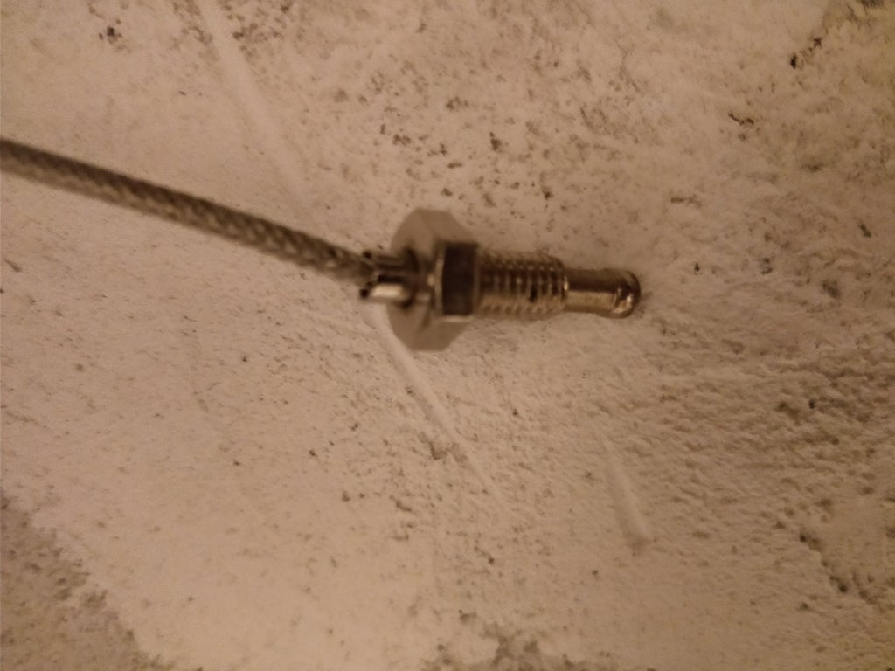

# Arduino Wood Stove Regulator

## Introduction

It is often tedious to control the air supply of a wood stove.

I built an automatic regulator that do it for you. It controls the air supply depending of the temperatures of the chimney.

The combustion is always optimal and you get the maximum calories out of your firewood.

You get a notification when a wood refill is needed.

At the end of the fire, the system automatically close the air supply to prevent the stove to cool down to fast.

***WARNING : always let a minium drawing. Not providing enough air supply to stove is dangerous. It can produce fatal CO gaz or incomplete burned gaz explosion.***

***Disclaimer : I am not responsible of any use of this project. By using this project you take all responsibilities of its configuration, implementation and usage.***

## The regulation

The regulation is controlled by an Arduino UNO.

It is connected to :

* a termocouple (max6675).
* a servo motor to control the valve (small one TowerPro 9g SG90)
* a buzzer
* a LCD screen (16x2)
* a potentiometer to control manually the air supply.
* a reset button 
  
If the air supply is set to the maximum, the Arduino switch to automatic mode and control the valve depending on the temperature measured by the thermocouple.

 

## The code

The Arduino sketch implements a PID control that stabilizes the temperature.

The Arduino sketch is open source and available for download here : [stove-regulation.ino](../Arduino/stove-regulation.ino) , please read the header before using it.  

I use Adafruit's max6675 library, it can be installed from the Arduino IDE.

IMPORTANT : You first have to configure the properties and the PID values so that they match your project .. (see step : Test and configure regulation )

## The Thermocouple

The thermocouple is a MAX6675 type.

Connect a wire from your Arduino to somewhere you can measure chimney or stove temperature.

Connect the thermocouple to that wire and fix the end in contact with the non isolated part of you stainless steel chimney or in contact with external part of the stove. Not inside the chimney !!

As told above, I use Adafruit's library. You can install the Adafruit's library from Arduino's IDE.

## The Valve

The case of the valve and servo is 3D printed.

The STL files are available for download.

* print the disc valve [disc](3DPrint/disc.stl)
* print the case with the cylinder [cylinder](3DPrint/cylindre.stl)
* print the servo-to-hinge connector [connector](3DPrint/connector.stl)
  
Please note that they are all printed in ABS, you might update printing size for other materials.

After initial configuration (see here below); you can fix the cylindre to the air supply. Connect a wire between the Arduino and the air supply.

Warning it must be an external air supply away from heat source !!

## The servo motor

The servo motor is a TowerPro SG90 type.

Push a long hook inside the valve's hinge.
Connect the hook to the servo motor with the connector 3D printed part
Push the hook and the servo inside the case with the valve in place
Fix the valve on the hook, I drill three small holes and put super glue inside.
Check that the valve is turning without resistance (the servo is not powerfull..)

The servo motor has to be calibrated with the two following variables :

* int angleCalibration = 90; // modify this value so that initial angle of the servo is 0° 
* float servoCalibration = 1;  // modify this value so that servo is at 90° when angle is 90°

## Regulation configuration

A regulation need some configuration, you may have to change the default parameters :

* float temperatureMin = 50; // under this temperature, the regulation starts an integral measure to estimate end or fire and close the valve

* float consigneTemperature=120.0; // the desired temperature measured by the thermocouple

* float kP=5; // P parameter of the PID regulation

* float kI=0.0005; // I parameter of the PID regulation

* float kD=0.00005; // D parameter of the PID regulation

* float refillTrigger = 5000; // refillTrigger used to notify need of a wood refill

* float closeTrigger = 15000; // closeTrigger used to close vlave at end of combustion and notifiy end of fire

* float potentioMax = 1023.0; // Potentiometre calibration

* int potentionRelMax = 80; // Potentiometre value above which the regulator runs in automatic mode

It is highly recommended to test the system before deploying it ..

Connect the thermocouple,
Upload the sketch to Arduino.
Connect the valve but do not connect it to the air supply yet.
Calibrate the zero angle of the servo motor.
First manually test the valve with the potentiometer
Then make a firewood and check the thermocouple and the valve behaviour (by simulating the air admission with your stove manual controller) To put the Arduino regulator in automatic mode, you have to put the potentiometer to 100%.

## The notifications

There are two notifications that can be customized :

* "wood refill" notification
 When a wood refill notification occurs, you have to put some wood, the wood refill message is going to disappear when the temperature goes up the target temperature again.
* "end of fire" notification
When a fire end notification occurs the valve closes to keep the heat in the stove. You can press the reset button to open it again the next time you want to start a new fire.

Both notification are based on the integral of the PID to be more accurate (than notifications based on temperatures)

The trigger values must be configured in the arduino sketch. You have to tune them for your wood stove.
If your refill notification raises to early, just increase refillTrigger variable.

* float refillTrigger = 5000; // refillTrigger used to notify need of a wood refill
* float closeTrigger = 15000; // closeTrigger used to close vlave at end of combustion
  

The notification and buzzer frequency and delay can be configured in the arduino sketch.
Buzzer variables :

* int buzzerPort = 9; // Buzzer port
* int buzzerRefillFrequency = 2000; // Buzzer tone frequency for refill alarm
* int buzzerRefillRepeat = 3; // Number of refill alarm tones
* int buzzerRefillDelay = 1000; // Delay of refill alarm tone
* int buzzerCloseFrequency = 1000; // Buzzer tone frequency for end of fire valve close alarm
* int buzzerCloseRepeat = 2; // Number of tones for end of fire valve close alarm
* int buzzerCloseDelay = 2000; // Delay of tone for end of fire valve close alarm

## Light the fire

Be sure you configured and tested as explained in previous steps.

To start in automatic mode, put the right potentiometer to the maximum to the right (more than 80% clockwise)
Check the values on the LCD (angle should be 90°, and drawing 100%)

Start a fire, check the temperature. When the temperature goes up the desired temperature (consigneTemperature in the sketch) the valve should close. If the fire becomes too weak, the valve should open. If the fire becomes too strong, the valve should close again. I something goes wrong, use the potentiometer below 80% to be in manual mode or use the manual control of your wood stove.

You can get some nice PID curves by getting the values with Arduino serial port and plotting them. (In red the valve angle, in blue the temperature)

At the end of the fire, the system automatically close the air supply to prevent the stove to cool down to fast.

To restart the system, press the reset button or  turn the potentiometer to zero then back to maximum value. 

***WARNING : always let a minium drawing. Not providing enough air supply to stove is dangerous. It can produce fatal CO gaz or incomplete burned gaz explosion.
Disclaimer : I am not responsible of any use of this project. By using this project you take all responsibilities of its configuration, implementation and usage.***